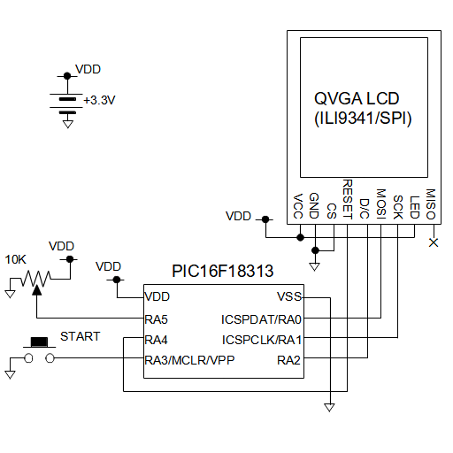
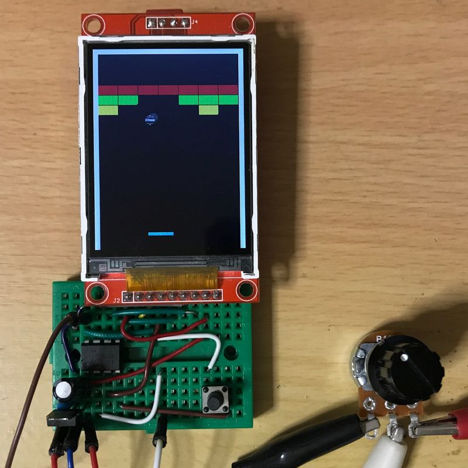

# 8ピン8bit PICマイコンによるカラー液晶利用実験
8ピンの8bitマイコンPIC16F18313でカラーグラフィック液晶を利用する実験をしました。  
実験題材として単純なブロック崩しゲームを作成しました。  
電源として+3.3Vが必要です。  
AD変換を利用して可変抵抗の値を読み込みます。  
  
## 回路図
  
  
## 遊び方
ファイルbreakout.hexをPICkitなどでPICマイコンに書き込んだ後、電源オンで起動します。  
STARTボタンを押すとゲームがスタートします。
可変抵抗を回転させることでパッドが左右に動きます。  
失敗しても特にゲームオーバーにはなりません。
全部のブロックを消すと最初に戻り、またSTARTボタンでゲームスタートします。  
衝突判定が少し甘いところや、ブロックの隅が微妙に欠けたりすることがあります。
あくまで液晶利用の実験だと思ってご容赦ください。  
ソースファイルを編集したい場合は、MPLAB XとXC8コンパイラでビルドしてください。
プログラム作成にはMicrochip Code Configulatorを利用しました。ビルドには不要です。  
  
  
